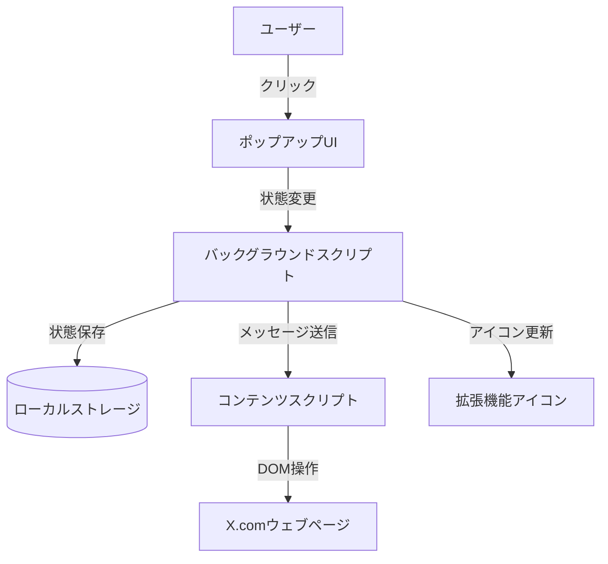

# 設計書

## 概要

Twitter Profile Hiderは、X.com（旧Twitter）のインターフェース左下に表示されるプロフィール情報（プロフィールアイコン、ユーザー名、ユーザーID）を非表示にするChrome拡張機能です。この拡張機能は、ユーザーがスクリーンショットを撮影したり画面を共有したりする際に、個人情報を保護することを目的としています。

## アーキテクチャ

この拡張機能は、以下のコンポーネントで構成されます：

1. **マニフェストファイル**: 拡張機能の基本情報と権限を定義
2. **コンテンツスクリプト**: X.comのページに挿入され、DOMを操作してプロフィール情報を非表示にする
3. **バックグラウンドスクリプト**: 拡張機能の状態を管理し、コンテンツスクリプトと通信する
4. **ポップアップUI**: ユーザーが拡張機能の状態を確認・変更するためのインターフェース
5. **アイコン**: 拡張機能の状態を視覚的に表示するためのアイコン

### アーキテクチャ図

## コンポーネントとインターフェース

### 1. マニフェストファイル (manifest.json)

Chrome拡張機能の設定ファイルで、以下の情報を含みます：
- 拡張機能の名前、説明、バージョン
- 必要な権限（X.comドメインへのアクセス）
- コンテンツスクリプト、バックグラウンドスクリプトの指定
- アイコンの指定
- ポップアップUIの指定

### 2. コンテンツスクリプト (content.js)

X.comのページに挿入され、以下の機能を提供します：
- DOMからプロフィール情報要素を特定
- CSSを動的に適用して要素を非表示/表示
- バックグラウンドスクリプトからのメッセージを受信して状態を更新
- MutationObserverを使用してDOMの変更を監視し、X.comの動的な更新に対応

### 3. バックグラウンドスクリプト (background.js)

拡張機能のライフサイクルを管理し、以下の機能を提供します：
- 拡張機能の状態（有効/無効）を管理
- ローカルストレージに状態を保存
- コンテンツスクリプトとメッセージを交換
- 拡張機能アイコンの状態を更新

### 4. ポップアップUI (popup.html, popup.js, popup.css)

ユーザーが拡張機能の状態を確認・変更するためのインターフェースで、以下の機能を提供します：
- 現在の状態（有効/無効）を表示
- 状態を切り替えるためのトグルボタン
- シンプルで直感的なUI

## データモデル

この拡張機能では、以下のデータを管理します：

1. **拡張機能の状態**
   - `enabled`: 真偽値（true/false）
   - ローカルストレージに保存され、ブラウザセッション間で維持される

2. **ターゲット要素のセレクタ**
   - X.comの左下に表示されるプロフィール情報要素を特定するためのCSSセレクタ
   - コンテンツスクリプト内でハードコードされる
   - X.comのインターフェース変更に対応するため、複数の可能性のあるセレクタを用意

## エラー処理

以下のエラーケースを考慮し、適切に処理します：

1. **要素が見つからない場合**
   - 複数のセレクタを試行
   - 要素が見つからない場合はコンソールにエラーを記録
   - 定期的に再試行するメカニズムを実装

2. **X.comのインターフェース変更**
   - MutationObserverを使用してDOM変更を監視
   - 複数のセレクタパターンを用意して柔軟に対応
   - 拡張機能の更新が必要な場合は、ユーザーに通知

3. **通信エラー**
   - バックグラウンドスクリプトとコンテンツスクリプト間の通信エラーを検出
   - エラー発生時は状態をリセットし、再試行

## テスト戦略

以下のテストを実施して、拡張機能の品質を確保します：

1. **単体テスト**
   - 各スクリプトの関数をJestなどのフレームワークでテスト
   - モックを使用してChrome APIをテスト

2. **統合テスト**
   - バックグラウンドスクリプトとコンテンツスクリプト間の通信をテスト
   - ローカルストレージの状態管理をテスト

3. **エンドツーエンドテスト**
   - 実際のX.comページで拡張機能の動作を確認
   - 異なるブラウザバージョンでの互換性テスト
   - 異なるX.comインターフェース（ダークモード/ライトモード、言語設定など）での動作確認

4. **パフォーマンステスト**
   - メモリ使用量の測定
   - CPU使用率の測定
   - ページ読み込み時間への影響測定

## セキュリティ考慮事項

1. **最小権限の原則**
   - 必要最小限の権限のみを要求（X.comドメインのみ）
   - ユーザーデータへのアクセスを制限

2. **コード保護**
   - コードの難読化を検討
   - センシティブな情報をハードコードしない

3. **更新メカニズム**
   - X.comのインターフェース変更に迅速に対応するための更新メカニズム